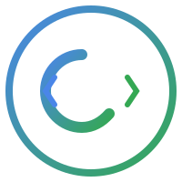
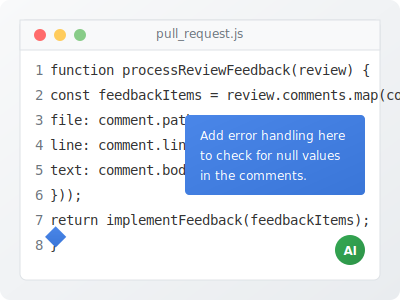
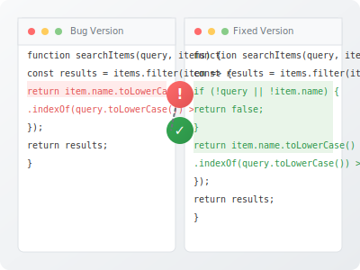
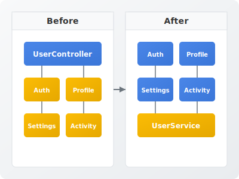

  

    
  

  <h1>Turn PR feedback into code instantly</h1>
  
ClaudeCoder is a GitHub Action that automatically processes pull requests using AWS Bedrock and Claude 3.7 Sonnet to generate and implement intelligent code changes.

  <a href="https://github.com/marketplace/actions/claudecoderaction" class="btn primary">Get Started with ClaudeCoderAction</a>
  <a href="#quickstart" class="btn secondary">Quick Start</a>

  

    
🤖

    <h3>AI-Powered Code Changes</h3>
    
Harness Claude 3.7 Sonnet's intelligence to analyze PR descriptions and automatically implement suggested changes.

  

  

    
🔄

    <h3>Seamless GitHub Integration</h3>
    
Works directly within your existing GitHub workflow with zero disruption to your development process.

  

  

    
🛠️

    <h3>Highly Configurable</h3>
    
Customize token limits, thinking capabilities, response handling, and more to fit your team's specific needs.

  

  <h2>Use Cases</h2>

  

    <h3>Implementing Code Review Feedback</h3>
    

      

        
When reviewers provide suggestions in natural language, ClaudeCoder can automatically implement the changes, saving developers time and ensuring feedback is addressed correctly.

        
Simply add the "claudecoder" label to your PR, and watch as the AI analyzes the review comments and makes the necessary changes.

      

      

        
      

    

  

  

    <h3>Fixing Bugs from Issue Descriptions</h3>
    

      

        
When bugs are reported in your issue tracker, ClaudeCoder can analyze the repository, identify the issue, and automatically generate a fix for review.

        
This accelerates bug resolution and ensures consistent code quality across your team.

      

      

        
      

    

  

  

    <h3>Refactoring Code Per Architecture Discussions</h3>
    

      

        
When architectural changes are discussed in PRs or issues, ClaudeCoder can help implement the necessary refactoring across multiple files.

        
The AI understands the codebase context and can make consistent changes that maintain your coding standards.

      

      

        
      

    

  

  <h2>Ready to supercharge your development workflow?</h2>
  
Start using ClaudeCoder today and let AI handle the implementation details while your team focuses on what matters.

  <a href="https://github.com/EndemicMedia/claudecoder" class="btn">View on GitHub</a>

  <h2>Quick Start Guide</h2>

  <ol>
    <li>
      
<strong>Add your AWS credentials as secrets in your GitHub repository:</strong>

      <ul>
        <li><code>AWS_ACCESS_KEY_ID</code>: Your AWS Access Key ID</li>
        <li><code>AWS_SECRET_ACCESS_KEY</code>: Your AWS Secret Access Key</li>
      </ul>
    </li>
    <li>
      
<strong>Create a workflow file</strong> at <code>.github/workflows/claudecoder.yml</code>:

      

        

          <pre class="highlight"><code>name: ClaudeCoderAction

on:
  pull_request:
    types: [opened, edited, labeled]
  pull_request_review_comment:
    types: [created, edited]
  issue_comment:
    types: [created, edited]

jobs:
  process-pr:
    if: contains(github.event.pull_request.labels.*.name, 'claudecoder')
    permissions: write-all
    runs-on: ubuntu-latest
    steps:
    - uses: actions/checkout@v3
    - name: ClaudeCoderAction
      uses: EndemicMedia/claudecoder@v2.0.0
      with:
        aws-access-key-id: ${{ secrets.AWS_ACCESS_KEY_ID }}
        aws-secret-access-key: ${{ secrets.AWS_SECRET_ACCESS_KEY }}
        github-token: ${{ secrets.GITHUB_TOKEN }}
</code></pre>
        

      

    </li>
    <li>
      
<strong>Add the "claudecoder" label to any PR</strong> where you want AI assistance.

    </li>
    <li>
      
<strong>Describe what changes you want</strong> in the PR description or comments.

    </li>
    <li>
      
<strong>Let ClaudeCoder work its magic!</strong> The action will analyze your description, make the requested changes, and commit them to your PR branch.

    </li>
  </ol>

  
<a href="/claudecoder/readme/" class="btn primary">View Full Documentation</a>

  <h2>Support the Future of Dev Productivity</h2>

  

    <h3>Bridging Human Creativity and AI Implementation</h3>
    
ClaudeCoder represents a new paradigm in developer workflows—where human creativity and strategic thinking combine with AI-powered implementation. Our small team of open-source contributors is dedicated to pushing this boundary further.

    
As the relationship between developers and AI evolves, we're committed to creating tools that enhance human capabilities rather than replace them. With your support, we can continue refining this vision.

    <h3>Ways to Support Our Work</h3>
    

      

        <h4>GitHub Sponsors</h4>
        
Directly fund our development through <a href="https://github.com/sponsors/EndemicMedia" target="_blank">GitHub Sponsors</a>. Even $5/month helps us dedicate more time to improving ClaudeCoderAction.

      

      

        <h4>Try Our Recommended Tools</h4>
        
We've tested dozens of AWS and developer tools. Support us by checking out these quality services through our affiliate links:

        <ul>
          <li><a href="https://aws.amazon.com/bedrock/" target="_blank">AWS Bedrock</a> - The foundation of ClaudeCoderAction's AI capabilities</li>
          <li><a href="https://github.com/features/copilot" target="_blank">GitHub Copilot</a> - Pair with ClaudeCoderAction for the ultimate AI coding experience</li>
        </ul>
      

      

        <h4>Contribute Code</h4>
        
Help us improve! We welcome pull requests for <a href="https://github.com/EndemicMedia/claudecoder/blob/main/ROADMAP.md" target="_blank">roadmap features</a>, bug fixes, or documentation enhancements.

      

    

    <h3>Building the Smart Development Ecosystem</h3>
    
We believe the future belongs to developers who effectively partner with AI tools. ClaudeCoderAction is our contribution to this ecosystem—transforming how teams implement feedback and accelerate development cycles.

    
Your support doesn't just fund a project; it helps shape a future where developers can focus on high-level problems while AI handles implementation details. Join us in making that vision a reality.

    

      <a href="https://github.com/sponsors/EndemicMedia" class="btn primary" target="_blank">Become a Sponsor</a>
    

  

